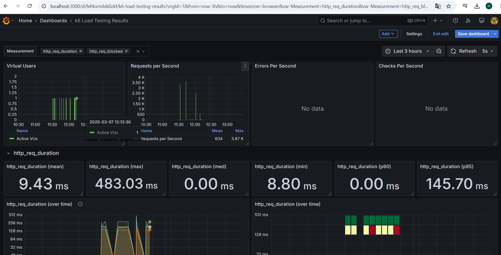

# 🚀 k6 Performance Testing Framework

Este repositório contém uma estrutura escalável para testes de performance usando k6.
Além dos testes tradicionais (Smoke, Load, Stress, Spike e Soak), a estrutura segue boas práticas como:

- ✅ Integração com Grafana para monitoramento em tempo real.
- ✅ Page Object Model (POM) para modularização e reuso de código.
- ✅ Organização por pastas para melhor escalabilidade.
---
## 📌 Tipos de Testes Implementados

   - Smoke Test (Teste de Fumaça) → Valida se a API responde corretamente antes de testes mais pesados.
   - Load Test (Teste de Carga) → Mede o desempenho sob uma carga esperada de usuários.
   - Stress Test (Teste de Estresse) → Descobre o limite máximo do sistema antes da falha.
   - Spike Test (Teste de Picos) → Simula picos repentinos de tráfego.
   - Soak Test (Teste de Imersão) → Avalia a estabilidade do sistema ao longo do tempo.

## 📂 Estrutura do Projeto

A estrutura modular permite escalabilidade e reutilização de código.
```sh
📦 k6-performance-tests
 ┣ 📂 settings
 ┃ ┣ 📜 settings.js      # Configuração global
 ┃ ┣ 📜 thresholds.js    # Definição de métricas esperadas
 ┃ ┣ 📜 stages.js        # Configuração de VUs e Stages
 ┃ ┣ 📜 report.js        # Função reutilizável para gerar relatórios HTML ✅
 ┣ 📂 pages
 ┃ ┣ 📜 api.js           # Métodos reutilizáveis para chamadas HTTP
 ┣ 📂 tests
 ┃ ┣ 📜 smoke-test.js    # Teste de Fumaça
 ┃ ┣ 📜 load-test.js     # Teste de Carga
 ┃ ┣ 📜 stress-test.js   # Teste de Estresse
 ┃ ┣ 📜 spike-test.js    # Teste de Picos
 ┃ ┣ 📜 soak-test.js     # Teste de Imersão
 ┣ 📂 reports            # Pasta onde os relatórios HTML serão salvos
 ┣ 📜 README.md          # Documentação do projeto
```
## 📦 Instalação

Antes de executar os testes, instale os pacotes necessários:
1️⃣ Instalar k6
🔹 Linux/macOS
```sh
brew install k6
```
🔹 Windows (via Chocolatey)
```sh
choco install k6
```
Ou baixe diretamente do site oficial: k6.io.
## 🏗️ Acessar do Grafana

1️⃣ Acessar o Grafana
Abra no navegador:

http://localhost:3000

Usuário: admin
Senha: admin

Adicione a fonte de dados Prometheus e importe um dashboard para visualizar os resultados.
▶️ Como Executar os Testes

Entre no diretório do projeto e execute um dos comandos abaixo:
1️⃣ Smoke Test
```sh
k6 run tests/smoke-test.js
```
2️⃣ Load Test
```sh
k6 run tests/load-test.js
```
3️⃣ Stress Test
```sh
k6 run tests/stress-test.js
```
4️⃣ Spike Test
```sh
k6 run tests/spike-test.js
```
5️⃣ Soak Test
```sh
k6 run tests/soak-test.js
```
## 📌 Para armazenar os resultados em JSON:
```sh
k6 run tests/script-test.js --out json=reports/results.json
```
## 📌 Para visualizar métricas no Grafana:
```sh
k6 run tests/script-test.js --out influxdb=http://localhost:8086/k6
```

